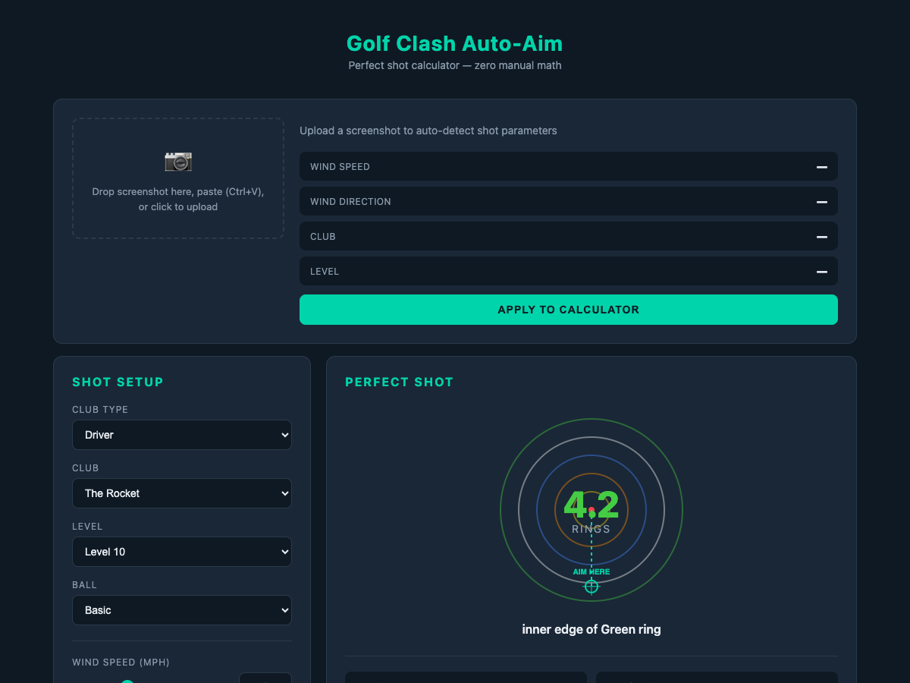
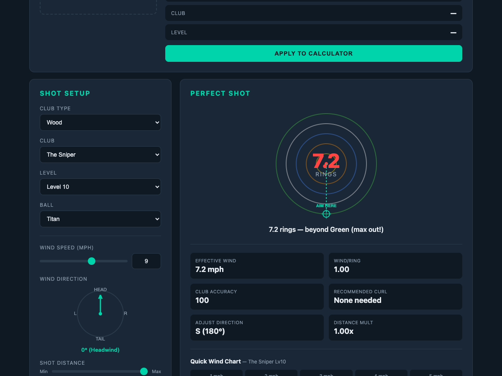
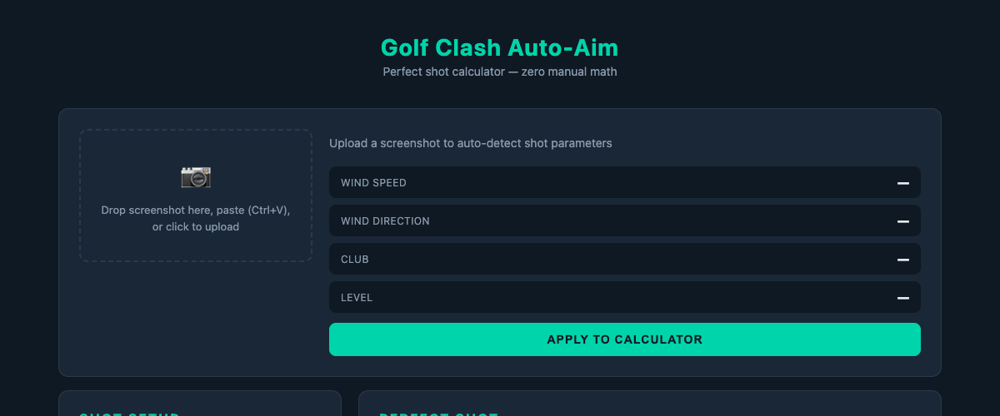
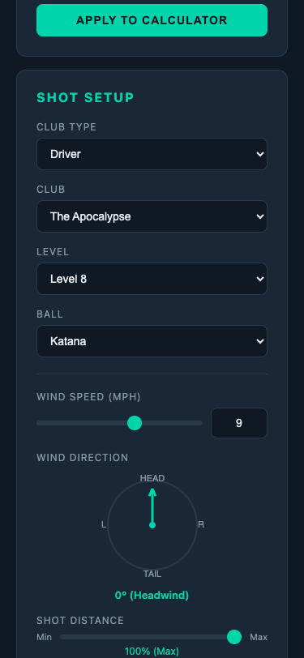

<div align="center">

# Golf Clash Auto-Aim

**The ultimate shot calculator for Golf Clash. Zero manual math. Instant ring adjustments.**

[](https://dist-psi-dun-81.vercel.app)
[](LICENSE)
[](https://developer.mozilla.org/en-US/docs/Web/JavaScript)
[](https://vitejs.dev)

<br />



<br />
<br />

[Live Demo](https://dist-psi-dun-81.vercel.app) &bull; [Features](#features) &bull; [Quick Start](#quick-start) &bull; [How It Works](#how-it-works) &bull; [Architecture](#architecture)

</div>

---

## The Problem

Golf Clash players spend hours doing mental math every single shot:

> *"OK, Sniper level 10 has 100 accuracy, so wind per ring is 1.0, wind is 8.5 mph crosswind with a Katana ball that has wind resist 2, so effective wind is 6.8, divided by 1.0 that's 6.8 rings, and I'm shooting uphill so subtract 10%..."*

**This tool does all of that instantly.**

## Features

### Instant Ring Calculator
Select your club, ball, wind conditions, and get the exact ring adjustment immediately. No charts, no memorization, no math.



### Visual Aim Guide
An interactive ring target visualization shows you exactly where to place your aim point, with a crosshair marker and color-coded rings matching the in-game target.

### Screenshot OCR (Beta)
Paste or drag-and-drop a game screenshot and the tool automatically reads:
- **Wind speed** from the HUD
- **Wind direction** from the arrow
- **Club name** and **level**

One click to apply all detected values to the calculator.



### Interactive Wind Compass
Click and drag to set wind direction. The compass shows headwind, tailwind, crosswind, and everything in between with real-time recalculation.

### Quick Wind Chart
Auto-generated reference chart for your current club showing ring adjustments for wind speeds 1-15 mph. Color-coded by ring zone (yellow, orange, blue, white, green).

### Complete Club Database
Every club in Golf Clash with stats at every level:
- **7 categories**: Driver, Wood, Long Iron, Short Iron, Wedge, Rough Iron, Sand Wedge
- **40+ clubs** with full stat progression
- **10+ ball types** with wind resistance values

### Mobile Responsive
Works on phones, tablets, and desktop. Use it on a second device next to your game or in split-screen.



---

## Quick Start

### Use the Live Demo

Visit **[dist-psi-dun-81.vercel.app](https://dist-psi-dun-81.vercel.app)** - no install needed.

### Run Locally

```bash
git clone https://github.com/carlos-rdz/golf-clash-auto-aim.git
cd golf-clash-auto-aim
npm install
npm run dev
```

Open `http://localhost:5173` in your browser.

### Build for Production

```bash
npm run build
```

Output goes to `dist/` - deploy anywhere (Vercel, Netlify, GitHub Pages, etc).

---

## How It Works

### The Ring Method

The core calculation is based on the community-standard **Ring Method**:

```
rings = (effective_wind / wind_per_ring) * distance_mult * elevation_mult
```

**Wind Per Ring (WPR)** is derived from club accuracy:
```
WPR = 3.0 - (accuracy / 10) * 0.2
```

| Accuracy | Wind/Ring | Example Club            |
|----------|-----------|-------------------------|
| 0        | 3.00      | Extra Mile Lv1          |
| 50       | 2.00      | The Rocket Lv1          |
| 100      | 1.00      | The Sniper (all levels) |

### Adjustments Applied

| Factor | Effect | Formula |
|--------|--------|---------|
| **Ball Wind Resist** | Reduces effective wind | `wind * (1 - resist * 0.1)` |
| **Shot Distance** | Shorter shots = less wind effect | `0.5 + (dist% / 100) * 0.5` |
| **Elevation** | Uphill reduces, downhill increases | `1 + elev% / 100` |
| **Curl** | Recommended for crosswind > 7 mph | Scaled to club's max curl |

### Ring Color Map

| Rings | Color  | Visual |
|-------|--------|--------|
| 0-1   | Yellow | Inner ring |
| 1-2   | Orange | Second ring |
| 2-3   | Blue   | Third ring |
| 3-4   | White  | Fourth ring |
| 4-5   | Green  | Outer ring |
| 5+    | Red    | Beyond target (max out!) |

---

## Architecture

```
golf-clash-auto-aim/
├── index.html              # Single-page app shell
├── src/
│   ├── main.js             # UI logic, event handling, DOM updates
│   ├── calculator.js       # Shot calculation engine (pure functions)
│   ├── clubs.js            # Complete club + ball database
│   ├── ocr.js              # Screenshot OCR using Tesseract.js
│   └── style.css           # Dark theme UI styles
├── package.json
└── docs/
    └── screenshots/        # README images
```

### Design Decisions

- **Zero backend** - Everything runs client-side. OCR, calculations, rendering. No server, no API calls, no data leaves the browser.
- **Vanilla JS** - No React, no framework. Single-page app in ~500 lines of JS. Fast to load, easy to understand.
- **Tesseract.js for OCR** - Full OCR engine running in the browser via WebAssembly. First load downloads the language model (~2MB), then it's cached.
- **Vite for tooling** - Fast dev server with HMR, optimized production builds with tree-shaking.

### Key Modules

**`calculator.js`** - Pure calculation engine with no DOM dependencies. Exports:
- `calculateShot()` - Main function, takes all parameters, returns ring adjustment + metadata
- `getWindPerRing()` - Accuracy to WPR conversion
- `getEffectiveWind()` - Apply ball wind resistance
- `generateWindChart()` - Pre-compute adjustments for wind 1-15 mph

**`clubs.js`** - Static database of all clubs and balls. Stats sourced from public community data ([golfclashnotebook.io](https://golfclashnotebook.io/clubs/)).

**`ocr.js`** - Screenshot processing pipeline:
1. Load image to canvas
2. Crop HUD regions (wind area, club area)
3. Enhance contrast for OCR
4. Run Tesseract recognition
5. Parse wind speed, club name, level from raw text
6. Analyze arrow pixels for wind direction

---

## Data Sources

All club stats, formulas, and game mechanics are sourced from publicly available community resources:

- [Golf Clash Notebook](https://golfclashnotebook.io/) - Club stats, wind tools
- [Golf Clash Tommy](https://www.golfclashtommy.com/) - Wind guides
- [AllClash](https://www.allclash.com/) - Club rankings, calculators

---

## Contributing

Contributions welcome! Some areas that could use work:

- [ ] More ball types and special event balls
- [ ] Hole-specific presets and saved configurations
- [ ] Improved OCR accuracy for different device resolutions
- [ ] PWA support for offline use
- [ ] Shot history and statistics tracking

```bash
# Fork, clone, then:
npm install
npm run dev
# Make changes, test, submit PR
```

---

## License

[MIT](LICENSE) - Use it, fork it, improve it.

---

<div align="center">

**Built for the Golf Clash community.**

If this tool helped your game, give it a star!

</div>
